# AI-Powered WhatsApp Logistics Automation Platform

A multi-workflow logistics automation system built with **n8n**, **OpenAI-powered agents**, **Meta WhatsApp webhooks**, **PostgreSQL**, and specialized workflow tools for quoting, shipment tracking, sales registration, and human escalation.

This repository is a **sanitized public portfolio version** of a larger production-style automation project. Production credentials, customer data, private endpoints, internal identifiers, and other sensitive implementation details are intentionally excluded.

## What the system does

The platform receives customer messages from WhatsApp, buffers fragmented conversations, extracts structured shipment information, preserves conversation state, and routes each request to the correct operational workflow.

Core capabilities include:

- WhatsApp message intake through Meta webhooks
- Message buffering and aggregation for fragmented conversations
- Semantic extraction of shipment and customer data
- Persistent quote and workflow state in PostgreSQL
- AI-based intent and workflow orchestration
- Official shipment quotation through a dedicated tool workflow
- Shipment tracking through a dedicated tracking workflow
- Sales / shipment-request registration after customer confirmation
- Human escalation for cases that require operations or advisor intervention
- Structured output validation before customer responses are sent
- Conversation logging for operational traceability

## Architecture

```mermaid
flowchart LR
    A[WhatsApp Customer] --> B[Meta WhatsApp Webhook]
    B --> C[Normalize Incoming Message]
    C --> D[PostgreSQL Message Buffer]
    D --> E[Wait + Latest Message Check]
    E --> F[Aggregate Pending Messages]
    F --> G[Load Persistent State]

    G --> H[Semantic Intake Extractor]
    H --> I[Validate Extracted Data]
    I --> J[Merge With Existing State]

    J --> K{Quote data complete?}
    K -- No --> L[Ask Only for Missing / Ambiguous Data]
    K -- Yes --> M[AI Logistics Agent]

    M --> N[Quotation Tool]
    M --> O[Shipment Tracking Tool]
    M --> P[Sales Registration Tool]

    N --> Q[Parse + Validate Output]
    O --> Q
    P --> Q
    M --> Q

    Q --> R[Persist Updated State]
    Q --> S{Escalation Required?}
    S -- Yes --> T[Operations / Human Escalation]
    S -- No --> U[Send Customer Reply]
    T --> V[Conversation Log]
    U --> V
```



The current design separates **language understanding** from **business-flow orchestration**:

1. A semantic extraction layer interprets the customer message and converts it into structured fields.
2. The extracted values are validated and merged with previously stored conversation state.
3. The main AI agent decides which business action is appropriate and invokes only the relevant tool.

This separation reduces repeated questions, preserves data across multiple WhatsApp messages, and keeps business actions behind explicit workflow boundaries.

## Message handling

Customers often send information across several short WhatsApp messages instead of one complete message. The workflow therefore uses a short buffer window before processing.

The flow:

1. Normalize the inbound message.
2. Store it in PostgreSQL.
3. Wait briefly for additional messages.
4. Check whether the current execution represents the latest message.
5. Aggregate unprocessed messages into a single conversational input.
6. Continue only from the latest execution.

This helps prevent duplicate replies and allows the system to understand fragmented requests as a single conversation turn.

## Stateful quotation intake

The quotation flow maintains a consolidated intake state instead of relying only on the latest message.

The state can preserve information such as:

- sender and recipient identity
- origin and destination
- pickup and delivery addresses
- package quantity
- weight or volumetric weight
- dimensions
- declared value
- payment method
- contact information

New information is merged with existing non-empty values, while explicit customer corrections can replace older values.

When required data is incomplete, the workflow asks only for the fields that are actually missing or ambiguous. Once the minimum data is complete, the quotation workflow is executed directly instead of asking for an unnecessary extra confirmation.

## Tool-based orchestration

The main AI agent has access to specialized tools rather than performing business operations itself.

### Quotation Tool

Used only for official shipment quotation. The agent does not manually invent freight, insurance, handling, service type, or total values.

### Shipment Tracking Tool

Used only when the customer wants to check a shipment or guide status.

### Sales Registration Tool

Used after an official quote has been delivered and the customer has explicitly confirmed that they want to continue. It registers the request but does not claim that a shipping guide has already been created.

### Human Escalation

Cases that require an advisor or operations intervention are routed through an escalation sub-workflow while preserving context for the next human operator.

## Reliability and safety decisions

The workflow contains several defensive rules designed to reduce automation errors:

- Do not request fields already present in the consolidated state.
- Do not overwrite valid stored data with empty values.
- Do not quote when required customer identification or address data is missing.
- Do not calculate official logistics pricing inside the language model.
- Do not register a sale before an official quote and customer confirmation.
- Do not claim a shipping guide exists unless a real guide number has been created.
- Validate and normalize AI output before it reaches the customer.
- Route operational exceptions to human escalation.

## Tech stack

- **n8n** — workflow orchestration
- **OpenAI / AI Agents** — language interpretation and decision orchestration
- **Meta WhatsApp API / Webhooks** — customer messaging channel
- **PostgreSQL** — message buffering and persistent workflow state
- **JavaScript** — validation, normalization, state merging, and workflow logic
- **Google Sheets** — operational conversation logging
- **REST / sub-workflow integrations** — logistics tools and internal operations

Additional browser automation components used by the broader project are documented separately and are not published with production credentials or session data.

## Repository structure

```text
.
├── README.md
├── .gitignore
└── docs/
    ├── architecture.md
    └── security.md
```

Sanitized workflow examples and additional technical documentation will be added incrementally.

## Why I built it

The goal of the project was to move beyond a simple chatbot and create a stateful automation system capable of handling real operational conversations.

The main engineering challenges included:

- understanding incomplete and fragmented customer messages
- preserving structured data across turns
- separating language understanding from operational decision-making
- preventing duplicate questions and repeated confirmation loops
- integrating AI reasoning with deterministic business tools
- protecting irreversible operations behind explicit workflow conditions
- maintaining enough context for human escalation

## Portfolio note

This repository demonstrates architecture, workflow design, state management, AI orchestration, and integration patterns. It is not intended to expose production infrastructure or confidential customer information.
