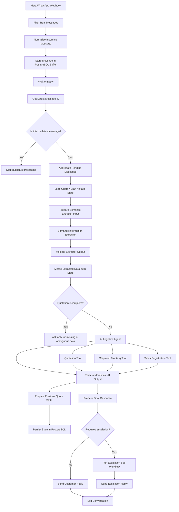

# Architecture

This document describes the public, sanitized architecture of the WhatsApp logistics automation workflow.

## High-level flow

## 1. Inbound messaging layer

The workflow begins with a Meta WhatsApp webhook and filters out events that are not real customer messages.

The normalized message includes the customer identifier, text, channel metadata, and message metadata needed by downstream nodes.

## 2. Fragmented-message buffer

WhatsApp conversations are rarely delivered as perfectly structured forms. Customers commonly send information in several rapid messages.

To handle this, the workflow:

1. inserts each message into a PostgreSQL buffer;
2. waits for a short collection window;
3. checks which execution corresponds to the latest message;
4. allows only that execution to continue;
5. aggregates the unprocessed messages in chronological order.

This design reduces duplicate bot responses and gives the AI layer a more complete conversational turn.

## 3. Persistent business state

The workflow reads multiple state objects from PostgreSQL, including a quotation intake state and later-stage quote / guide-draft state.

The purpose is to separate:

- the latest natural-language message;
- structured customer information collected over time;
- official quotation values;
- the current stage of the post-quote process.

This means a new message does not need to contain every field again.

## 4. Semantic extraction layer

A separate information-extraction model interprets the aggregated customer message before the main agent makes an operational decision.

Its output is validated before being merged into the existing state.

The merge layer follows three important rules:

- preserve previously confirmed, non-empty values;
- incorporate newly detected values;
- replace previous values only when the customer clearly corrects them.

The merged state calculates the fields that are genuinely still missing.

## 5. Deterministic completeness gate

Before the main agent attempts an official quotation, the workflow checks whether the required quotation data is complete.

Typical required groups include:

- sender identity, city, and pickup address;
- recipient identity, city, and delivery address;
- package quantity;
- real weight;
- dimensions or volumetric weight;
- declared value;
- payment method.

If information is missing, the system asks only for the missing or ambiguous field rather than restarting the intake process.

## 6. AI orchestration layer

The main AI Logistics Agent receives a compact representation of the current message and internal state.

It is responsible for choosing the appropriate action, but operational work is delegated to specialized tools.

### Quotation

The quotation tool is the only component responsible for obtaining official freight-related values. The language model is explicitly prevented from inventing official price, service, insurance / handling, or delivery-time values.

### Tracking

The shipment tracking tool is isolated from quotation and sales operations and is used only for guide / shipment-status requests.

### Sales registration

The registration tool is available only for the post-quotation flow. A completed intake is not treated as an accepted quotation. Registration requires an official successful quotation and explicit customer intent to continue.

## 7. Output validation

AI output is parsed into a defined response structure before being used by downstream nodes.

Normalization covers booleans, numeric values, aliases returned by tool responses, and customer-facing message content.

This creates a controlled interface between probabilistic model output and deterministic workflow logic.

## 8. State persistence

After processing, structured intake and draft state are prepared and persisted back to PostgreSQL.

State is used to preserve:

- current intake values;
- quotation status;
- customer acceptance;
- required email collection where applicable;
- registration identifiers;
- workflow stage.

## 9. Human escalation

The workflow checks whether a response requires human intervention.

When escalation is required, a dedicated sub-workflow is executed and the customer receives the appropriate escalation response. Normal requests continue directly to the customer-response path.

Both paths converge on conversation logging.

## Design principle

The architecture intentionally combines probabilistic AI with deterministic boundaries:

> **AI interprets and chooses; workflow logic validates, persists, and controls business actions.**

That separation is central to making the automation more reliable than a single unrestricted chatbot prompt.
